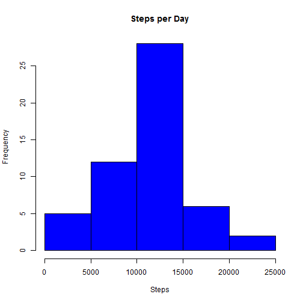
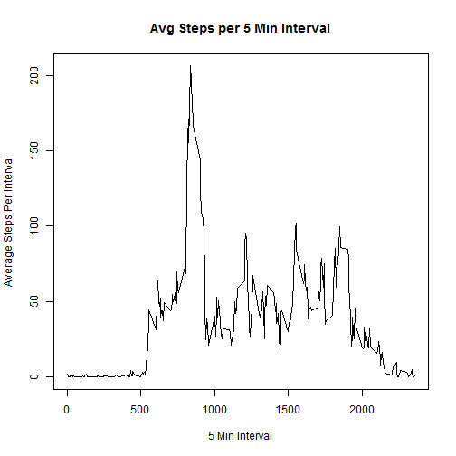
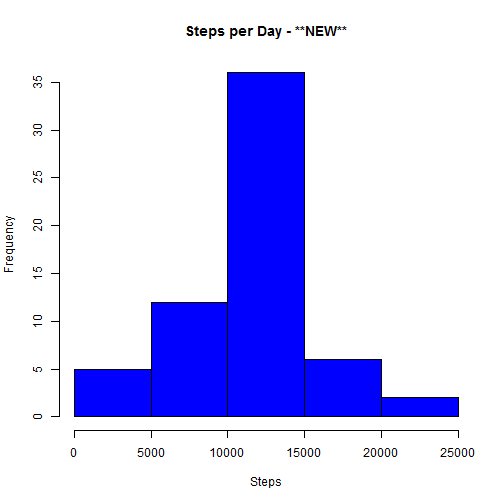
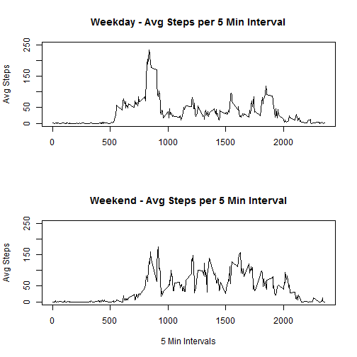

#Reproducible Research
Assignment 1
==================================================

First, the data is downloaded and read into R studio. the first data table excludes incomplete data, while the other does not.


```r
file <- "C:/Users/knobbe/Documents/PTO, Time Sheets, etc/Coursera/Data Science Specialization/5. Reproducable Research/activity.csv"
data <- na.omit(read.csv(file,stringsAsFactors=F))
dataNA <- read.csv(file,stringsAsFactors=F)
str(data)
```

```
## 'data.frame':	15264 obs. of  3 variables:
##  $ steps   : int  0 0 0 0 0 0 0 0 0 0 ...
##  $ date    : chr  "2012-10-02" "2012-10-02" "2012-10-02" "2012-10-02" ...
##  $ interval: int  0 5 10 15 20 25 30 35 40 45 ...
##  - attr(*, "na.action")=Class 'omit'  Named int [1:2304] 1 2 3 4 5 6 7 8 9 10 ...
##   .. ..- attr(*, "names")= chr [1:2304] "1" "2" "3" "4" ...
```

##Histogram, mean, and median of steps taken each day:


```r
hist(aggregate(data$steps,by=list(data$date),sum)[,2],
     main="Steps per Day",
     xlab="Steps",
     col="blue")
```

 

```r
mean1 <- format(mean(aggregate(data$steps,by=list(data$date),sum)[,2]),big.mark=",",decimal.mark=".")
median1 <- format(median(aggregate(data$steps,by=list(data$date),sum)[,2]),big.mark=",",decimal.mark=".")
```

The mean and median of steps per day when excluding unknown data points is 10,766 and  10,765, respectively.

##Average daily activity:


```r
plot(unique(data$interval),
     aggregate(data$steps,by=list(data$interval),mean)[,2],
     type="l",
     main="Avg Steps per 5 Min Interval",
     xlab="5 Min Interval",
     ylab="Average Steps Per Interval")
```

 

```r
maxInterval <- aggregate(data$steps,by=list(data$interval),mean)[
  which.max(aggregate(data$steps,by=list(data$interval),mean)[,2]),]
Interval <- maxInterval[1,1]
Steps <- maxInterval[1,2]
```

The maximum activity occurs in interval 835 with about 206.1698 steps taken.

##Inputing missing values


```r
meanMean <- mean(aggregate(data$steps,by=list(data$interval),mean)[,2])
rowsMissing <- nrow(dataNA) - nrow(data)
dataNA[is.na(dataNA[,1]),1] <- mean(aggregate(data$steps,by=list(data$interval),mean)[,2]) 
```

The approach I took to inputing missing values was to set them equal to the   average daily activity per 5 minute interval, which is about 37.3826.


The number of missing rows that were filled in equalled 2304.

Below is a histogram of the new data.

```r
hist(aggregate(dataNA$steps,by=list(dataNA$date),sum)[,2],
     main="Steps per Day - **NEW**",
     xlab="Steps",
     col="blue")
```

 

```r
mean2 <- format(mean(aggregate(dataNA$steps,by=list(dataNA$date),sum)[,2]),big.mark=",",decimal.mark=".")
median2 <- format(median(aggregate(dataNA$steps,by=list(dataNA$date),sum)[,2]),big.mark=",",decimal.mark=".")
```

The mean and median of steps per day with the new data points is 10,766 and  10,766, respectively. As you can see, the mean and median did not change much; however, there was a large increase in the frequency of steps per day.

##Activity Patterns Between Weekdays and Weekends


```r
data$weekday <- weekdays(as.POSIXct(data$date,"%y-%m-%d"))
```

```
## Warning: unknown timezone '%y-%m-%d'
## Warning: unknown timezone '%y-%m-%d'
## Warning: unknown timezone '%y-%m-%d'
## Warning: unknown timezone '%y-%m-%d'
## Warning: unknown timezone '%y-%m-%d'
## Warning: unknown timezone '%y-%m-%d'
## Warning: unknown timezone '%y-%m-%d'
## Warning: unknown timezone '%y-%m-%d'
## Warning: unknown timezone '%y-%m-%d'
## Warning: unknown timezone '%y-%m-%d'
## Warning: unknown timezone '%y-%m-%d'
## Warning: unknown timezone '%y-%m-%d'
## Warning: unknown timezone '%y-%m-%d'
```

```r
data$weekdayGrp <- as.factor(
        ifelse(data$weekday == "Saturday" | data$weekday == "Sunday", 
         "Weekend", "Weekday"))
splitdata <- split(data,data$weekdayGrp)
par(mfrow=c(2,1))
plot(unique(data$interval),
     aggregate(splitdata[[1]]$steps,by=list(splitdata[[1]]$interval),mean)[,2],
     type="l",
     main="Weekday - Avg Steps per 5 Min Interval",
     ylab="Avg Steps",
     xlab="",
     ylim=c(0,250))
plot(unique(data$interval),
     aggregate(splitdata[[2]]$steps,by=list(splitdata[[2]]$interval),mean)[,2],
     type="l",
     main="Weekend - Avg Steps per 5 Min Interval",
     xlab="5 Min Intervals",
     ylab="Avg Steps",
     ylim=c(0,250))
```

 


